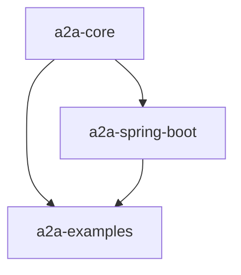

# A2A Java SDK

> **Status:** 🚧 **Coming Soon - Version 0.1.0** 🚧
> **Current Phase:** Core Implementation Complete | Spring Boot Integration Ready | gRPC & Testing In Progress

A comprehensive Java implementation of the [Agent2Agent (A2A) protocol](https://github.com/google-a2a/A2A) that enables seamless communication and interoperability between AI agent systems through JSON-RPC 2.0 over HTTP/HTTPS with optional gRPC support.

## 🚀 **Project Overview**

The A2A Java SDK brings enterprise-grade, production-ready A2A protocol support to the Java ecosystem. Inspired by the [Python A2A implementation](https://github.com/google-a2a/a2a-python), this project provides a robust, multi-module architecture designed for scalability, maintainability, and framework flexibility.

### **Key Features**

- ✅ **Complete A2A Protocol Support** - Full JSON-RPC 2.0 implementation with all A2A message types
- ✅ **Multi-Module Architecture** - Framework-agnostic core with optional Spring Boot integration
- ✅ **Production-Ready** - Enterprise patterns, proper error handling, and comprehensive validation
- ✅ **Type-Safe** - Full type hierarchy with Jackson serialization and JSR-303 validation
- ✅ **Reactive Streams** - Built on Project Reactor for non-blocking, backpressure-aware operations
- 🚧 **gRPC Support** - High-performance binary protocol (coming in v0.1.0)
- 🚧 **Spring Boot Starter** - Auto-configuration and production features (coming in v0.1.0)

## 📦 **Multi-Module Architecture**

```
a2a-java/
├── a2a-core/                    # Framework-agnostic A2A implementation
├── a2a-spring-boot/             # Spring Boot integration & auto-configuration
├── a2a-examples/                # Reference implementations & examples
└── README.md                    # This file
```

### **Module Dependencies**



### **Usage Patterns**

#### **Framework-Agnostic Usage**
```xml
<dependency>
    <groupId>io.microagents</groupId>
    <artifactId>a2a-core</artifactId>
    <version>0.1.0</version>
</dependency>
```

#### **Spring Boot Applications**
```xml
<dependency>
    <groupId>io.microagents</groupId>
    <artifactId>a2a-spring-boot</artifactId>
    <version>0.1.0</version>
</dependency>
```

## 🏗️ **Architecture & Design**

### **Clean Package Organization**

```
a2a-core/src/main/java/io/microagents/a2a/core/
├── client/                      # Client interfaces & implementations
│   ├── A2AClient.java           # Main client interface
│   ├── A2ACardResolver.java     # Agent discovery & capabilities
│   └── HttpClient.java          # HTTP transport abstraction
├── server/                      # Server framework & task management
│   ├── A2AJsonRpcServer.java    # JSON-RPC 2.0 server
│   ├── TaskManager.java         # Task lifecycle management
│   ├── EventQueue.java          # Reactive event streaming
│   └── AgentExecutor.java       # Business logic interface
└── types/                       # Complete A2A type system
    ├── core/                    # Domain types (Task, Message, Agent, etc.)
    ├── requests/                # JSON-RPC request/response types
    ├── notifications/           # Push notification types
    ├── exceptions/              # Exception hierarchy
    └── security/                # Security schema types
```

### **Key Design Principles**

- **🔀 Reactive Streams**: All APIs return `Mono<T>`/`Flux<T>` for composable, non-blocking operations
- **🛡️ Type Safety**: Comprehensive type hierarchy with validation and serialization
- **🎯 Framework Agnostic**: Core module has minimal dependencies (Reactor, Jackson, SLF4J)
- **🔧 Extensible**: Plugin architecture for custom agent implementations
- **📊 Observable**: Built-in support for metrics, tracing, and monitoring

## 🐍 **Inspiration: A2A Python**

This implementation draws inspiration from the mature [Python A2A SDK](https://github.com/google-a2a/a2a-python/) while adapting to Java ecosystem patterns:

| Feature | Python A2A | Java A2A | Notes |
|---------|------------|----------|--------|
| **Protocol Support** | ✅ Complete | ✅ Complete | Full A2A spec compliance |
| **Async/Reactive** | AsyncIO | Project Reactor | Different paradigms, same benefits |
| **Type Safety** | Pydantic | Jackson + JSR-303 | Compile-time + runtime validation |
| **Framework Integration** | FastAPI/Django | Spring Boot | Ecosystem-appropriate choices |
| **gRPC Support** | ✅ Full | 🚧 In Progress | Coming in v0.1.0 |
| **Agent Examples** | Multiple | EchoAgent | More examples coming |

## 📋 **Current Status & Roadmap**

### **✅ Completed (Ready for v0.1.0)**

- [x] **Core Data Models** - Complete A2A type hierarchy (Phase 3)
- [x] **Client Implementation** - HTTP/JSON-RPC client with auth & timeouts (Phase 4)
- [x] **Server Framework** - JSON-RPC server with routing & validation (Phase 5)
- [x] **Task Management** - Lifecycle management, events, persistence (Phase 6)
- [x] **Multi-Module Structure** - Clean separation of concerns
- [x] **Google Java Format** - Consistent code style throughout
- [x] **Examples** - EchoAgentExecutor reference implementation

### **🚧 In Progress (v0.1.0 Release)**

- [ ] **gRPC Implementation** - High-performance binary protocol (Phase 7)
- [ ] **Spring Boot Starter** - Auto-configuration & production features (Phase 8)
- [ ] **Comprehensive Testing** - Unit, integration, and compatibility tests (Phase 9)
- [ ] **Documentation** - API docs, guides, and tutorials (Phase 10)

### **🔮 Future Versions**

- [ ] **Observability** - Micrometer metrics & distributed tracing
- [ ] **Security** - Advanced authentication & authorization
- [ ] **Performance** - Connection pooling & optimization
- [ ] **Cloud Native** - Kubernetes, Docker, and cloud deployment guides

## 🛠️ **Development**

### **Prerequisites**

- **Java 21+** (uses modern language features)
- **Maven 3.8+** for dependency management
- **Protocol Buffers 3.25+** for gRPC code generation

### **Build Commands**

```bash
# Build all modules
./mvnw clean compile

# Run tests
./mvnw test

# Format code (Google Java Format)
./mvnw com.spotify.fmt:fmt-maven-plugin:format

# Generate gRPC code
./mvnw protobuf:compile protobuf:compile-custom

# Package for distribution
./mvnw package
```

### **Module-Specific Development**

```bash
# Build only core module
./mvnw -pl a2a-core clean compile

# Build only Spring Boot module
./mvnw -pl a2a-spring-boot clean compile

# Build only examples
./mvnw -pl a2a-examples clean compile
```

## 📝 **Quick Start Example**

```java
// Framework-agnostic usage
A2AClient client = new SpringA2AClient(webClient, baseUrl);

// Send a message to an agent
SendMessageRequest request = SendMessageRequest.of()
    .withMessage(Message.userText("Hello, agent!"))
    .withTaskId("task-123");

Mono<SendMessageSuccessResponse> response = client.sendMessage(request);

// Stream real-time responses
Flux<SendStreamingMessageResponse> stream = client.sendStreamingMessage(
    SendStreamingMessageRequest.of()
        .withMessage(Message.userText("Stream this!"))
);
```

## 🤝 **Contributing**

We welcome contributions! This project follows:

- **Google Java Format** for code style
- **Conventional Commits** for commit messages
- **GitHub Flow** for development workflow
- **Comprehensive Testing** for quality assurance

## 📄 **License**

This project is licensed under the [Apache 2.0 License](LICENSE) - see the LICENSE file for details.

## 🔗 **Related Projects**

- **[AI Agent Gateway](https://github.com/microagents/gateway/)** - Enterprise AI agent orchestration platform we are working on

---

**🚀 Ready to build the future of AI agent communication? Star this repo and join the A2A ecosystem!**
